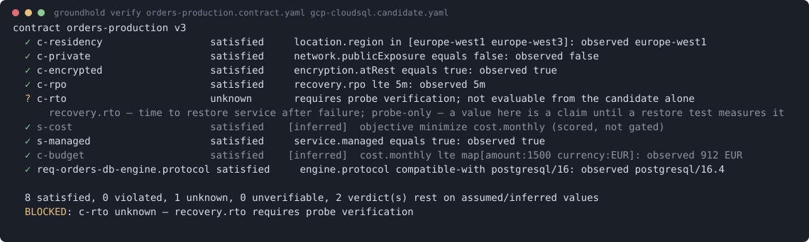

# Groundhold

> AI should not write Terraform. It should emit verifiable contracts —
> and a deterministic runtime should validate, gate, execute and prove them.

[](https://github.com/groundhold/groundhold/actions/workflows/ci.yml)
[](https://github.com/groundhold/groundhold/actions/workflows/codeql.yml)
[](https://github.com/groundhold/groundhold/actions/workflows/security.yml)
[](https://github.com/groundhold/groundhold/actions/workflows/lint.yml)
[](LICENSE)

**Status: public, experimental (`v0.x`) — an RFC you can run, not GA.**
An honest self-assessment — what is proven vs merely built vs designed — lives in
[`docs/MATURITY.md`](docs/MATURITY.md): the verification core is proven and
adversarially hardened; execution has closed the loop against all three clouds and
Kubernetes — 144 of the 145 services have now been run against a real cloud, and a
real k3s/k8s cluster exercised all ten mapped services (D509–D549). Read that
precisely: "field-tested" means it ran against a real cloud — mostly **our own**
accounts, each run cited in [`docs/COVERAGE.md`](docs/COVERAGE.md) — **not** that an
external operator ran it. The external track record is one AWS pilot that filed 36
findings; there is no external security audit, and there is one production incident
groundhold contributed to (2026-07-26 — it did not cause a bad deploy, it removed the
signal that would have surfaced one).
## TL;DR — see it work in 60 seconds, no cloud account

Grab a binary — no toolchain, no clone — from
[**github.com/groundhold/groundhold/releases**](https://github.com/groundhold/groundhold/releases),
then:

```sh
gh release download v0.1.7 --repo groundhold/groundhold \
  --pattern 'groundhold_linux_amd64' --pattern 'SHA256SUMS'
sha256sum -c SHA256SUMS --ignore-missing
chmod +x groundhold_linux_amd64
```

Swap `linux_amd64` for `linux_arm64`, `darwin_amd64` or `darwin_arm64`. While
the project is pre-1.0 every build is published as a **prerelease**, and GitHub
deliberately excludes those from `/releases/latest` — so the tag is named
explicitly above rather than pretending a permanent "latest" link works. Each
release also ships version-less asset names, so the moment a stable release
exists this becomes a one-liner that never goes stale:
`curl -Lo groundhold …/releases/latest/download/groundhold_linux_amd64`.

Every release carries `SHA256SUMS`, a CycloneDX SBOM and `BUILDINFO.txt` for a
reproducible rebuild; the checksums cover all three (D680), and the download above
fetches the sums file so the verification line has something to read — following
the old snippet literally left `sha256sum: SHA256SUMS: No such file or directory`. Every
release also carries a keyless SLSA build-provenance attestation, verifiable with
`gh attestation verify <asset> --repo groundhold/groundhold` (D354). That command
prints nothing at all when it succeeds and exits 0 — silence is the pass; a
failure is loud.

Now the loop, with **only** that binary — the tool writes its own documents:

```sh
./groundhold_linux_amd64 example contract > my.contract.yaml
./groundhold_linux_amd64 example candidate my.contract.yaml > my.candidate.yaml
# fill in the two blanks the scaffold leaves: service, and location.region
./groundhold_linux_amd64 converge my.contract.yaml my.candidate.yaml \
  --ledger state/try.jsonl --provider fake \
  --at "$(date -u +%FT%TZ)" --yes
```

The first run applies; run it again and it reports CONVERGED without touching
anything. `fake` is a built-in in-process provider, so there is nothing to sign
up for and nothing to clean up. Leave a blank unfilled and the run ends
`VIOLATED`, naming the hard constraint that failed and stopping before it
touches anything — that is the tool working, not a misconfiguration.

Prefer to build it yourself? Go ≥ 1.25 and nothing else:

```sh
cd go && go build -o ../bin/groundhold-go ./cmd/groundhold && cd ..
```

With a clone you also get the curated examples, which is what the rest of this
page uses. The binary works identically — but the example FILES come with the
clone, so the commands below are the built path, not the download path above.

```sh
bin/groundhold-go converge \
  examples/laptop/laptop.contract.yaml examples/laptop/laptop.candidate.yaml \
  --ledger state/try.jsonl --provider fake \
  --at "$(date -u +%FT%TZ)" --yes
```

```
converge → apply
→ apply
  applied
converge → observe
→ observe (recording reality)
converge → convergence-check
  ✓ converged — verified against observed reality
converge phases:
  ✓ verify
  ✓ plan
  » observe (evidence fresh)
  ✓ forecast
  ✓ confirm
  ✓ apply
  ✓ observe
  ✓ convergence-check
CONVERGED
```

Run the identical command again:

```
  ✓ converged — the world already matches the candidate
CONVERGED
```

Nothing was touched, and convergence was *proven* against what the world
reported back — not assumed because an apply exited zero. `fake` is a built-in
in-process provider, so there is nothing to sign up for and nothing to clean up.

## What a verdict looks like



Six things are happening in that one screen, and they are the reasons this
project exists rather than features bolted onto it.

`c-rto` is **`unknown`, not `false`.** Recovery time is not provable by reading
configuration — only a restore test measures it — so the system says so instead
of guessing, and the run ends `BLOCKED` rather than proceeding. A verdict is
`satisfied | violated | unknown | unverifiable`, and there is **no flag that
lets an unproven hard constraint through**.

The two dimmed rows are **provenance rendered as brightness**: `s-cost` and
`c-budget` are satisfied, but they rest on *inferred* values, and the summary
counts them — `2 verdict(s) rest on assumed/inferred values`. Where a number
came from travels with the number.

The dim line under `c-rto` **teaches in passing**. Every refusal explains itself
and carries a machine error code whose remediation is documented
(`groundhold explain <code>`), which is what lets an agent recover from a
rejection instead of guessing. Where an honest invocation-specific step exists
the refusal also carries a structured `next` — a runnable command, an edit to
make, or permissions to grant — and where one does not, it is **omitted rather
than guessed**.

And none of it involves a model. **The verifier is deterministic** — no LLM, no
network, no heuristics — so the same documents always produce the same verdict.
The probabilistic part proposes; this part decides.

## Using it: create, change, delete

Everything below runs on `fake` and is checked on every commit
([`examples/check.sh`](examples/check.sh)) — these are not illustrations, they
are tests.

### Create

Two capabilities. The contract names no vendor; the candidate proposes how.

```sh
bin/groundhold-go converge \
  examples/lifecycle/1-create.contract.yaml examples/lifecycle/1-create.candidate.yaml \
  --ledger state/orders.jsonl --provider fake --at "$(date -u +%FT%TZ)" --yes
```

```
→ forecast
  plan:
    create a-create-assets [R1 dataLoss=none downtime=none]
    create a-create-db [R1 dataLoss=none downtime=none]
  forecast rollup: willCreate 2
converge → confirm
converge → apply
→ apply
  applied
converge → observe
→ observe (recording reality)
converge → convergence-check
  ✓ converged — verified against observed reality
```

### Change the intent, and watch it refuse

Now the data must stay in the EU. The implementation did not change — the
*contract* got stricter, and the proposal is a database in `us-east-1`:

```sh
bin/groundhold-go verify \
  examples/lifecycle/2-refused.contract.yaml examples/lifecycle/2-refused.candidate.yaml
```

```
  ✓ c-db-managed                 satisfied     service.managed equals true: declared true
  ✗ c-eu-only                    violated      location.region in [eu-central-1 eu-west-1]: declared us-east-1
      location.region — Primary region of the instance

  1 satisfied, 1 violated, 0 unknown, 0 unverifiable
  VIOLATED: c-eu-only violated — location.region
```

Exit 2, before a plan is compiled, let alone applied. The offending value is
named. There is no flag that lets a violated hard constraint through.

### Delete

Retirement is explicit — `state: retired`, never mere absence, so that "I forgot
to write it" and "destroy it" can never be the same edit:

```sh
bin/groundhold-go converge \
  examples/lifecycle/3-retire.contract.yaml examples/lifecycle/3-retire.candidate.yaml \
  --ledger state/orders.jsonl --provider fake --at "$(date -u +%FT%TZ)" --yes
```

```
  plan:
    delete a-delete-assets [R4 dataLoss=certain downtime=certain] target=fake:assets-db46c0e38fdf
  forecast rollup: willDelete 1
converge → confirm
…
  plan contains dataLoss/identity-replacing actions — --yes does not cover destruction; add --allow-data-loss or confirm interactively
REFUSED consent-required
```

`--yes` deliberately does **not** cover destruction; that needs
`--allow-data-loss`, and only then does the delete run. Note the target is
`fake:assets-db46c0e38fdf` — the exact resource, pinned from the ledger's
recorded binding rather than guessed from the file you just edited.

## Pointing it at a real cloud

Groundhold talks to provider APIs directly. Credential handling is a
**deliberately narrow adapter, not the cloud SDK credential chains** — there is
no `gcloud`/`aws`/`az`/`kubectl` shell-out and no tool coupling. What that means
in practice per provider:

| Provider | Where credentials come from |
|-------|------------------------------|
| **AWS** | `AWS_ACCESS_KEY_ID`, `AWS_SECRET_ACCESS_KEY`, `AWS_SESSION_TOKEN` (env only — `~/.aws/credentials` and `AWS_PROFILE` are **not** read). Region from `AWS_REGION`, falling back to `AWS_DEFAULT_REGION`. |
| **GCP** | In order: `GROUNDHOLD_GCP_ACCESS_TOKEN` (a ready token) → `GROUNDHOLD_GCP_KEY_FILE` (a `service_account` key JSON **only** — no federation configs, no user credentials) → the GCE metadata server. Not ADC. |
| **Azure** | `GROUNDHOLD_AZURE_ACCESS_TOKEN`, an AAD bearer token. A full client-credentials exchange is a later addition. |
| **Kubernetes** | A kubeconfig context — the same file `kubectl` reads — with STATIC auth only: a bearer token or a client certificate. `exec` / auth-provider plugins (`gke-gcloud-auth-plugin`, `aws eks get-token`, oidc) are refused loudly rather than shelled out to, for the same reason as the clouds: authentication must not depend on ambient tooling. |

So an engineer arriving with a working cloud CLI exports a short-lived token
rather than pointing at a profile:

```sh
# GCP
export GROUNDHOLD_GCP_ACCESS_TOKEN="$(gcloud auth print-access-token)"

# Azure
export GROUNDHOLD_AZURE_ACCESS_TOKEN="$(az account get-access-token --query accessToken -o tsv)"

# AWS — the three standard variables, however you normally obtain them
export AWS_ACCESS_KEY_ID=... AWS_SECRET_ACCESS_KEY=... AWS_REGION=eu-central-1
```

Then the same command, with the provider swapped:

```sh
bin/groundhold-go converge my.contract.yaml my.candidate.yaml \
  --ledger state/prod.jsonl --provider aws --at "$(date -u +%FT%TZ)"
```

Two things happen automatically before anything is mutated. The plan declares
the permissions each action needs, and apply preflights them against the acting
identity — refusing *before* touching infrastructure rather than failing
halfway. And dropping `--yes` makes converge stop at the plan and wait for you
to type `apply`; in a pipe it refuses outright rather than assuming consent.

This is the least proven part of the system, and
[`docs/MATURITY.md`](docs/MATURITY.md) says so plainly: all three clouds have closed
the loop against real accounts (mostly our own — COVERAGE.md cites each run), but the
only **external** operator so far has been on AWS.

## Using it with an AI agent

The premise is that an agent proposes and a deterministic runtime disposes, so
the agent-facing surface is a first-class part of the system rather than a
wrapper someone added later.

**MCP server.** `groundhold mcp` speaks MCP over stdio and exposes
`groundhold_verify`, `groundhold_plan`, `groundhold_forecast`,
`groundhold_observe`, `groundhold_hash`, `groundhold_draft` and — only when
explicitly enabled — `groundhold_apply`. To wire it up:

```sh
bin/groundhold-go mcp --print-config
```

which prints both the `.mcp.json` block and the one-liner
(`claude mcp add groundhold -- …`). The read-only tools are always available;
the apply tool mutates infrastructure and stays off unless the server is started
with `GROUNDHOLD_MCP_ALLOW_APPLY=1`, and it is two-step by design.

**How an agent learns the system.** Not by being told to read the source.
`groundhold explain` is the single place to ask about any noun the runtime
emits — every machine error code and every vocabulary attribute:

```sh
bin/groundhold-go explain capability.database.relational --vocab spec/vocab
```

```
capability.database.relational — capability type (11 attributes)
  availability.class  (string = zonal|regional|multi-regional)
  cost.monthly  (money) — Projected monthly cost of the capability
  …
  recovery.rto  (duration) — Time to restore service after failure
  …
  next: groundhold explain <attribute> for one; groundhold example candidate <contract.yaml> to scaffold
```

Error codes answer the same way — `groundhold explain consent-required` returns
what it means and what to do next. Every refusal carries a machine code and a
`next` step, so an agent recovers from a rejection instead of guessing.

**Packaged workflows.** [`.claude/skills/`](.claude/skills/) holds the
agent-side procedures: `draft-contract` (prose → contract), `code-to-contract`
(read an app repo, infer its infrastructure needs with citations),
`emit-candidate`, `bake-off` (compare vendors deterministically — the runtime
gates eligibility, a human picks), `onboard-existing` and `adopt-candidate`
(bring infrastructure Groundhold did not create under contract),
`transcript-to-contract` (a meeting recording → a draft), and `dr-forensics`.

## What you meet later

Not front-page material, but the reasons the front page holds up.

Every run appends to a **hash-chained ledger** — `groundhold export` replays it,
`groundhold audit` checks recorded reality back against the contract and reports
violations as transitions rather than heartbeats. Evidence **travels**: events
can be signed (`keygen`, `--sign-key`, `--trust`), a single capability's
subchain can be lifted out as a standalone **evidence capsule** that verifies on
its own, and an **anchor** catches the one thing a capsule cannot — an omission.

Before anything is mutated, a plan **declares the permissions each action
needs** and apply checks them against the acting identity, so a run refuses up
front instead of failing halfway. Cost is projected, not guessed, and labelled a
projection rather than a quote.

Infrastructure that already exists is not a second-class citizen: `discover` →
`adopt` brings it under contract, and a **converged no-op run is the proof** the
takeover worked. `groundhold parity` shows, per capability, whether each cloud
fulfils it, structurally cannot, or simply has no driver yet — which is what
makes a vendor **bake-off** a deterministic comparison rather than an opinion.

## What this is

A specification and reference implementation for **Infrastructure Contracts**:
a typed, machine-first medium in which agents (and humans) declare *what must
be true* about infrastructure, instead of writing the implementation by hand.

Core ideas:

1. **Constraints, not resources, are the unit of meaning.** A contract says
   `dataResidency in EU`, `rpo <= 5m`, `publicExposure == false`. The
   implementation is an output, not the source of truth.
2. **Provenance is a type.** Every value knows whether it was `declared`,
   `inferred`, `assumed` or is `unknown` — because the author is a
   probabilistic model and the medium must say so.
3. **Four-valued verification.** Every constraint verdict is `satisfied`,
   `violated`, `unknown` or `unverifiable`. The system never pretends to have
   checked something it hasn't. `unknown` on a hard constraint blocks execution.
4. **Constraints declare how they are proven** (`static`, `provider-api`,
   `probe`). An RTO claim is not satisfied by configuration — only by a
   measured restore test.
## Repository layout

```
spec/           the normative artifacts: schemas, vocabularies, canonicalization,
                state model, sealed plan IR, examples
ref/            reference implementation (Python): loader, four-valued verifier,
                canonical hashing, concurrency scenario engine
go/             Go runtime — passes the identical conformance suite through
                its own binary
conformance/    language-independent test cases — the real definition of semantics
docs/           design decisions and rationale (D1–D1004)
```

## Building from source, and the gates

For working *on* Groundhold rather than with it. Requirements: Go ≥ 1.25,
Python ≥ 3.12 + PyYAML. Nothing else — the runtime is stdlib + yaml only.

```
make check                              # every gate: vet + all suites, both implementations
cd go && go build -o ../bin/groundhold-go ./cmd/groundhold   # the CLI binary
make verify          # verify the example candidate against the example contract
make conformance-go  # just the Go runtime, through its own binary
```

A full walkthrough (your first contract, converge, brownfield adoption) lives
in [`website/pages/quickstart.md`](website/pages/quickstart.md); how to
contribute is in [`CONTRIBUTING.md`](CONTRIBUTING.md).

Document identity and the concurrency semantics are executable too:

```
ref/groundhold.py hash spec/examples/orders-production.contract.yaml
bin/groundhold-go  hash spec/examples/orders-production.contract.yaml   # same bytes
```

Example output — note the system refusing to execute because RTO is only
provable by a restore test:

```
  ✓ c-residency   satisfied
  ✓ c-private     satisfied
  ✓ c-encrypted   satisfied
  ✓ c-rpo         satisfied
  ? c-rto         unknown      requires probe verification
      recovery.rto — time to restore service after failure;
      a value here is a claim until a restore test measures it
  ✓ c-budget      satisfied    [inferred]

  5 satisfied, 0 violated, 1 unknown, 0 unverifiable
  BLOCKED: c-rto unknown — recovery.rto requires probe verification
```

## Where this is now

The original vertical slice — intent to contract to verify to compile to sealed
apply to observe to converge — is closed, and has run against real clouds. The
complete record of decisions and their reasons is `docs/DESIGN.md` (D1–D1004);
[`docs/MATURITY.md`](docs/MATURITY.md) says what is proven versus merely built
and names the gaps. What follows is the short version of everything that came
after the slice.

## Since the vertical slice (the short version)

- **Breadth**: 145 service mappings across AWS (54), GCP (46) and Azure (45),
  fulfilling 50/45/45 distinct capability TYPES respectively — one type is often
  reached by several services (rds and aurora both fulfil
  `capability.database.relational`, D76). Counts are read from the drivers' own
  certified `ServiceCapabilities()` maps, not from prose. Reached through a
  parity program (D166–D172) that records per-cloud gaps honestly instead of
  faking symmetry.
- **Contracts that wire themselves** (D226, D275–D286): an operand may be a
  typed reference to another capability's output — resolved from the producer's
  receipt in the same plan, or folded at compile from a fresh observation when
  the producer already exists. No interpolation, no expression language: a
  reference is a structured node, kind-checked, and every failure refuses.
- **Field hardening** (D248–D283): a real AWS pilot drove sequential cluster
  upgrades through `converge` and found what hermetic tests could not — a poll
  against a nonexistent API path whose unit fake mirrored the same wrong
  assumption, and a transport regression that broke every request while CI
  stayed green. Both classes now have gates that touch a real endpoint
  (D272/D274).
- **Adversarial rounds** (D178–D195, D286, D312–D323): the recurring find is a
  *fail-open in the direction of "everything is fine"* — including ones this
  project introduced itself and then closed. The second sweep audited the
  disaster-recovery family, the MCP boundary, the gentle crawl, adoption and the
  proactive classifier; it found a guard keyed on the very field it guarded, a
  failure code an author could choose by naming a capability `api-keys`, a
  confirmation token that pinned the plan but not where it landed, a rate limiter
  one unset field turned off, and — sharpest — that invariant 0 checked the
  safety clock was PRESENT, never that it PARSED (D323). Most of what it probed
  held: the write-up records what was checked and found sound, not only what
  broke.
- **Debts paid, with the gate that keeps them paid** (D306–D311, D317): every
  read that produced nothing now names its cause instead of saying "unreadable"
  (639 → 0, gated); a failed mutation no longer pastes the provider's raw
  response — which is persisted in the ledger and signed into capsules — into
  the receipt; an attribute's evidence class moved out of ~190 hand-copied driver
  cases into the vocabulary that defines it.

## What's next

- **`capability.ai.speech` drivers** — the GCP recogniser and the Azure account.
  The type and its semantics landed first (D350); AWS has no ASR resource to
  author, so it is witnessed there rather than faked.
- **A capability for customer-managed IAM policy.** The recurring field ask, and
  the honest shape: the policy document is an implementation operand, never
  contract semantics, because the constraint operator set is closed.
- **Invoke mode and response streaming** on `capability.function.serverless` — a
  silent mismatch between a function URL's setting and the container's own
  breaks streaming while every health signal stays green.
- **An external operator beyond AWS.** Azure and GCP are field-tested on our own
  accounts (COVERAGE.md cites each); what they lack that AWS has is someone else
  running them in anger. That external track record is the next bar, not a first
  green run.
- **A first stable release.** The repository is public, `main` is protected and
  Pages is live; what remains is graduating from `v0.x` prereleases to a first
  stable (`v1.0`) release, which is also what turns the download link above into
  a permanent one.

Questions left deliberately open are recorded in `docs/DESIGN.md`. The largest is
a delegated executor for two-phase or airgapped provisioning, where the second
phase must execute from inside a runner the first phase created — a change of
execution locus mid-plan that the single-vantage executor cannot express today.

## Non-goals for v0.x

**No expression language in constraints**, and no interpolation or logical
connectives. Complexity is expressed as more constraints, not richer ones. This
is an invariant, not a scheduling decision.

**No cross-capability references inside constraints.** A constraint names one
subject and one path. References between capabilities do exist — an operand in
the candidate may point at another capability's typed output (D226) — but they
are structured, kind-checked nodes in the implementation block, never a way to
compute one verdict from two subjects.

**No contract inheritance.** `compose` merges a base with per-environment
overlays into one flat contract; the result is a document, not a hierarchy
resolved at verify time.

**No organizational policy layer.** Groundhold governs a contract, not an
estate: there is no equivalent of an SCP or an org policy, and a rule that must
hold across accounts is expressed as constraints in each contract.

**Not a complete capability taxonomy.** Vocabularies grow from demand that
arrives with a use case. A capability that cannot be honestly witnessed on a
supported cloud is refused rather than faked — which is why some clouds carry a
declared structural gap instead of a third mapping.

**Not a Terraform generator** (D39). The compiler targets the Sealed Plan IR and
the executor speaks provider APIs; `.tf.json` is at most an optional export,
never on the execution path.

## Support

Maintainer-led, best-effort, **no SLA** — except security, where
`SECURITY.md` commits to a 72-hour acknowledgement of a private
advisory. Bug reports are welcome in any shape, but a report reduced to
a failing conformance case is the one that gets fixed fastest, because
it arrives already true. `CONTRIBUTING.md` explains why that is the
mechanism rather than a formality.

## License

Dual-licensed by component: **Apache 2.0** for the spec, conformance
suite, and reference implementation (`LICENSE`); **MPL 2.0** for the Go
runtime (`LICENSE-runtime`). Contributions are inbound=outbound under the
per-directory license — see `CONTRIBUTING.md`; the never-relicense
commitment is in `GOVERNANCE.md`.
